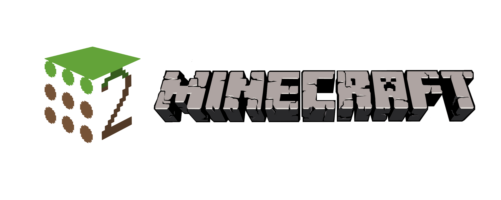

# minecraft-ros2

**Repositories for integrating Minecraft and ROS 2**

This organization manages repositories that connect Minecraft and ROS 2 to make robotics education and research more engaging. The following repositories are included:

## Repository List

### [minecraft\_ros2](https://github.com/minecraft-ros2/minecraft_ros2)

A Minecraft mod that enables communication with ROS 2. It allows for LiDAR simulation, sensor data transmission, command reception, and more.

### [minecraft\_msgs](https://github.com/minecraft-ros2/minecraft_msgs)

A set of ROS 2 message definitions specifically designed for Minecraft. Includes message types for sensors and actuators.

### [minecraft\_ros2\_example](https://github.com/minecraft-ros2/minecraft_ros2_example)

A collection of sample projects demonstrating the integration of Minecraft with ROS 2, including examples such as SLAM (Simultaneous Localization and Mapping).

### [ros2\_java](https://github.com/minecraft-ros2/ros2_java)

A Java-based ROS 2 library for use within the Minecraft mod to enable ROS 2 communication.

---

## Community

* Issues and Pull Requests are welcome!
* Please refer to each repository's README for contribution guidelines.
* Share your ideas and suggestions for improvement!

## License

Please check the license of each repository.

---

Let's build a fun and educational world of Minecraft × ROS 2 together!
